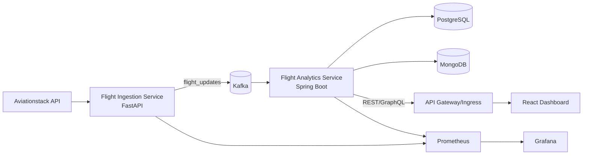

# AeroStream Architecture

## Event-Driven Topology

## Kafka Schemas
- `flight_updates`
  - `event_id`, `flight_number`, `departure_airport`, `arrival_airport`, `delay_minutes`, `status`, `route_key`, `ingested_at`
- `delay_events`
  - subset of delayed flights with severity flags.
- `route_performance`
  - route-level aggregates (`avg_delay`, `reliability_score`, `window_start`, `window_end`).
